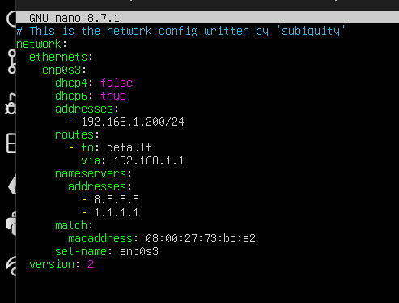

# HW-04 - IPSec VPN with HTTPS

## Network Topology

* **LAN A:** `192.168.10.0/24`
* **LAN B:** `192.168.20.0/24`
* **R1-SEDE-A WAN:** `10.0.0.1`
* **R2-SEDE-B WAN:** `10.0.0.6`
* **Client:** `192.168.10.10`
* **Server:** `192.168.20.10`

---

## IPSec Tunnel Mode - R1(R1-SEDE-A)

---

## IPSec Tunnel Mode - R2(R2-SEDE-B)

---

## IPSec Verification - R1(R1-SEDE-A)

The encrypted and decrypted packet counters confirm that traffic is passing through the VPN tunnel.

---

## IPSec Verification - R2(R2-SEDE-B)

The router is encrypting and decrypting traffic through the IPSec tunnel.

---

## Connectivity Test

A ping from the client in LAN A to the server in LAN B.

---

## HTTPS Test (https://192.168.20.10)

