# Assessment 01 (Group 4)

### Mayda Daniela Matul Alvarado - 1535523
### Grecia Fernanda Fuentes Hernández - 1537723

## ZeroTier Configuration

A new ZeroTier network was created with the name `assessment-01`.

**Network ID: 363c67c55a5a2b2f**


The IPv4 subnet configured for the network is:

```text
10.241.9.0/24 and 10.242.9.0/24
```
---

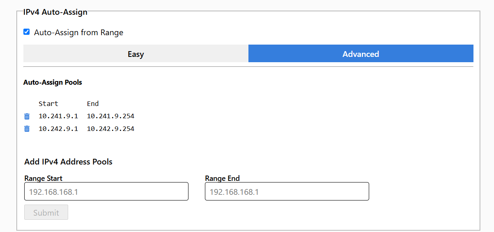

## Client Configuration

## Hostname Configuration


```text
cliente-01
```


```text
cliente-02 
```


```text
cliente-03
```

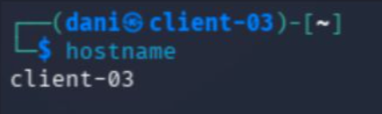

---

```text
router
```

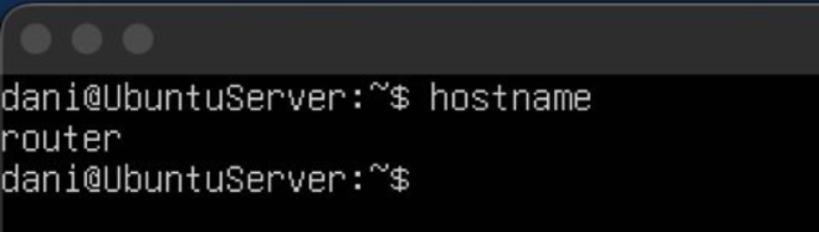

---

## Static IP Configuration

A static ZeroTier IPv4 address was manually assigned.

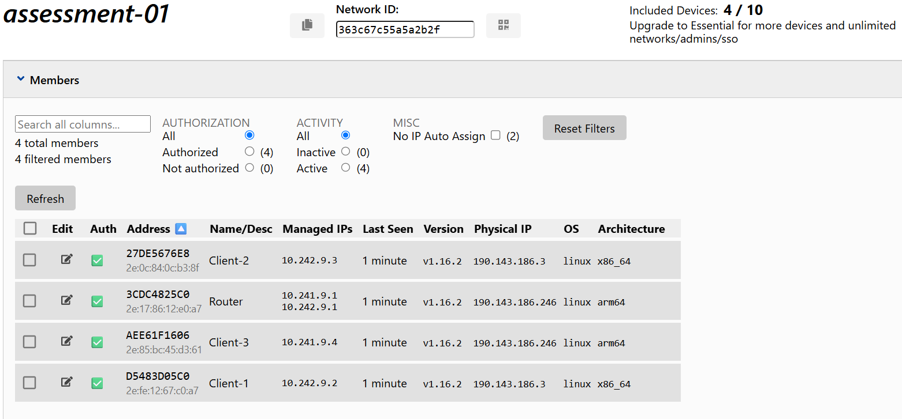


```text
router (10.241.9.1 / 10.242.9.1)
```

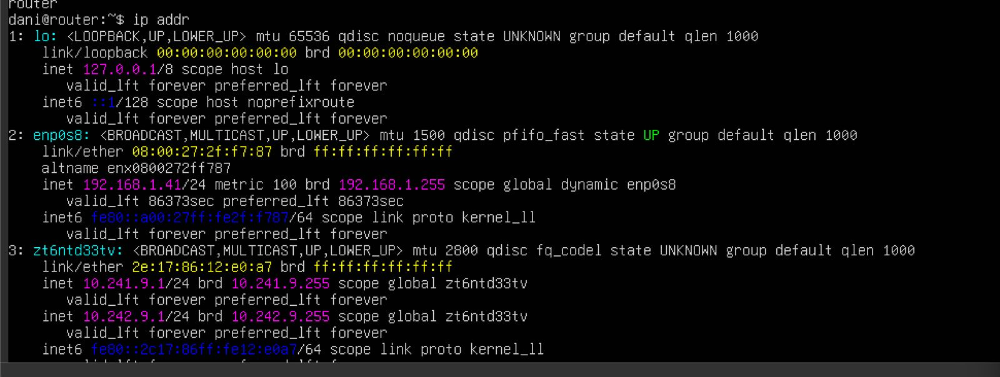


```text
cliente-01 (10.242.9.2)
```

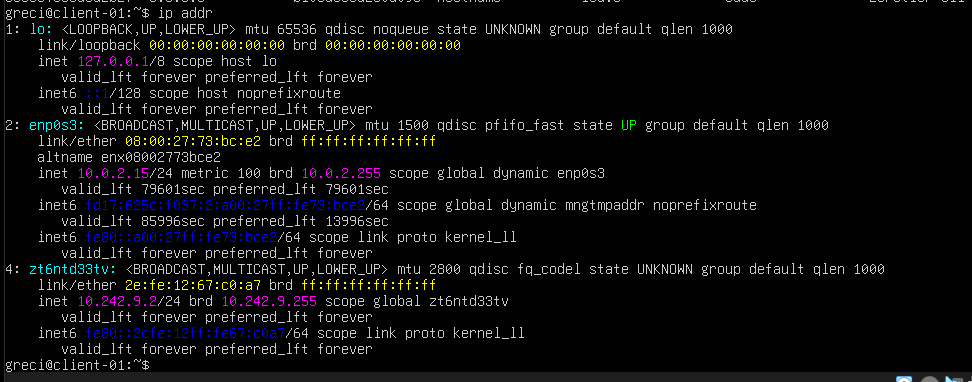

```text
cliente-02 (10.242.9.3)
```


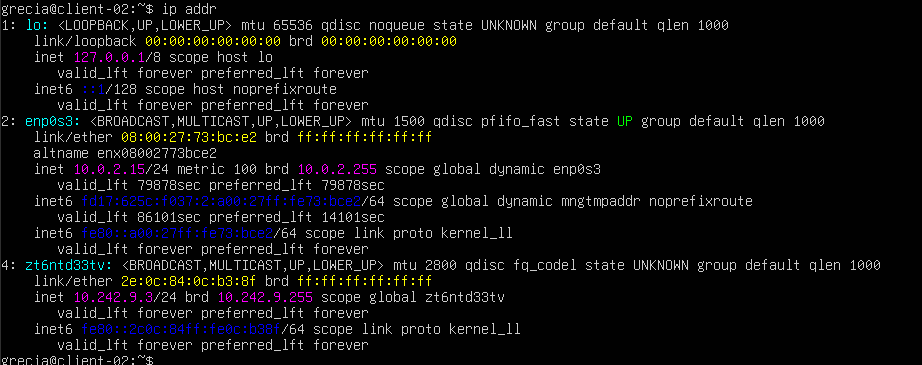


```text
cliente-03 (10.241.9.4)
```

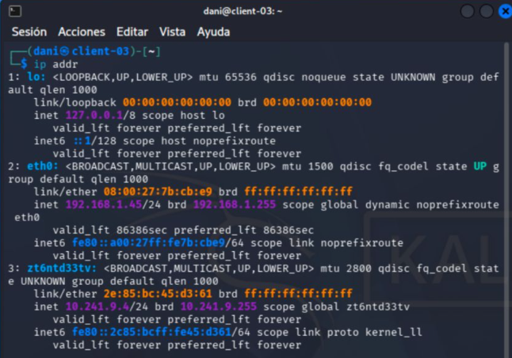


## Managed Route

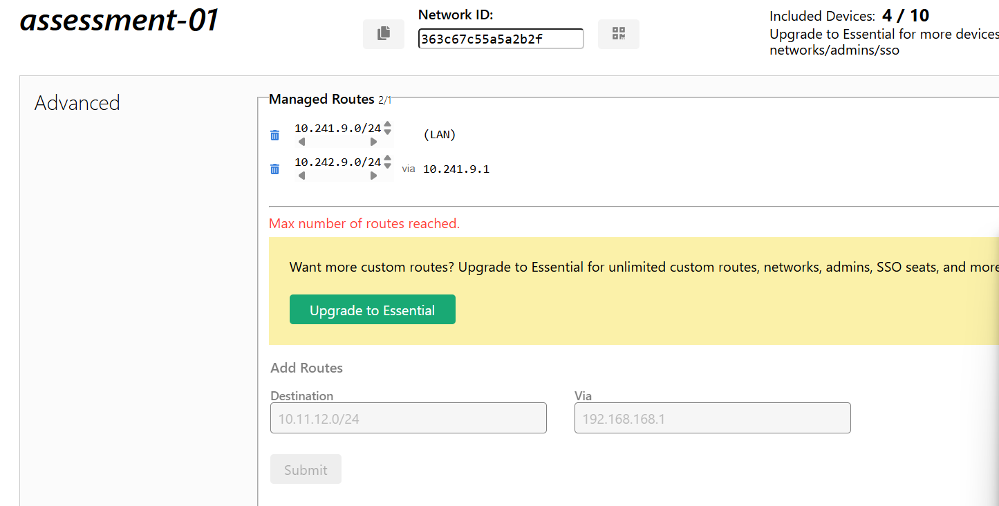


## IP forwarding

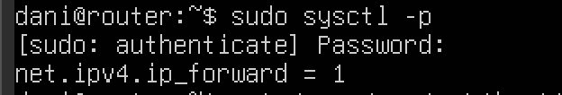

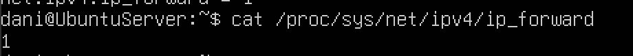

## ICMP connectivity test (Ping)


```text
cliente-01 to cliente-02 and cliente-03 
```

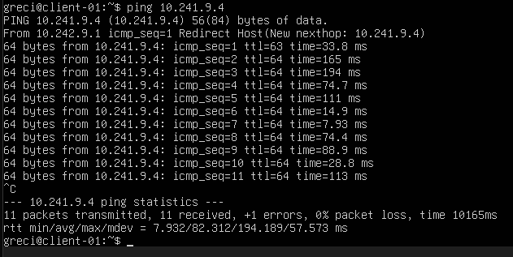
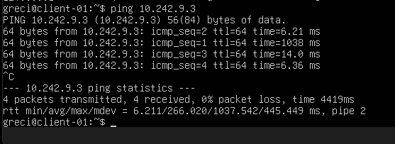

```text
cliente-02 to cliente-01 and cliente-03 
```

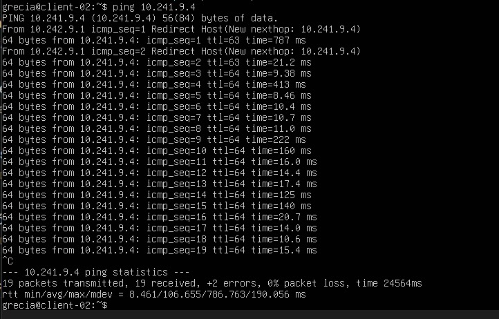
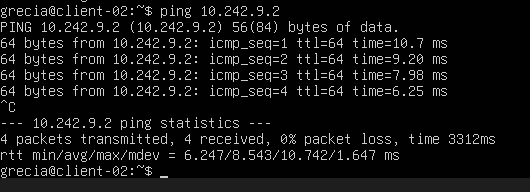


```text
cliente-03 to client-01 and to cliente-02
```

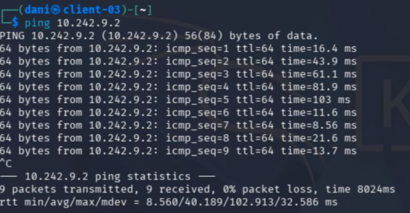

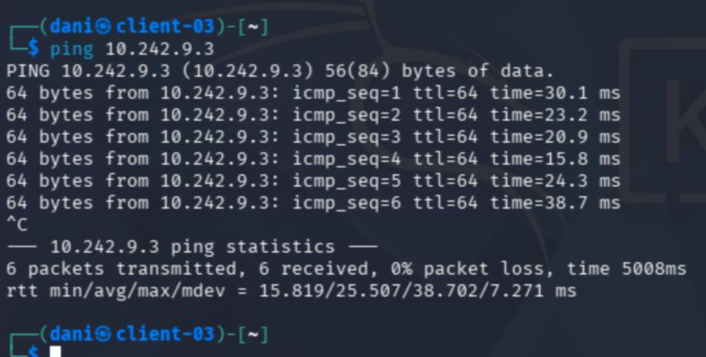


## Network path  (Tracepath)

```text
cliente-01 to cliente-02 and cliente-03 
```

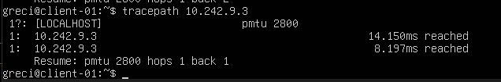
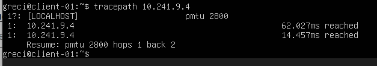

```text
cliente-02 to cliente-01 and cliente-03 
```


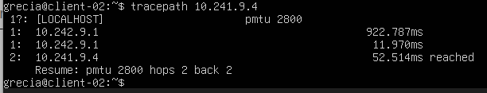


```text
cliente-03 to client-01 and to cliente-02
```

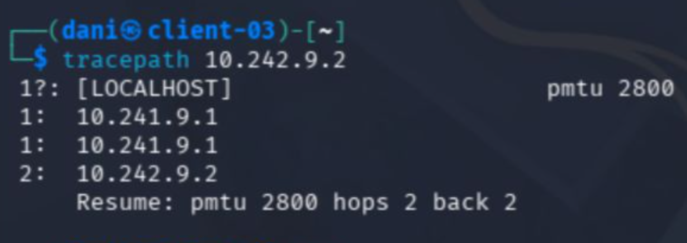
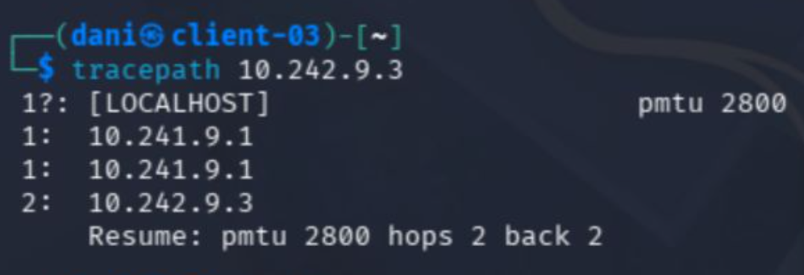