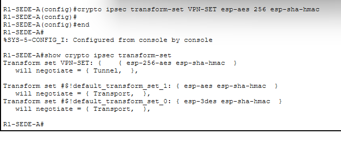
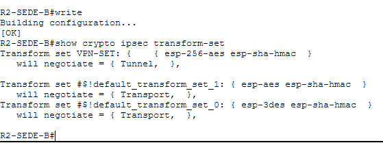
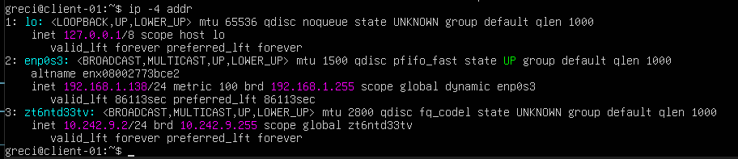
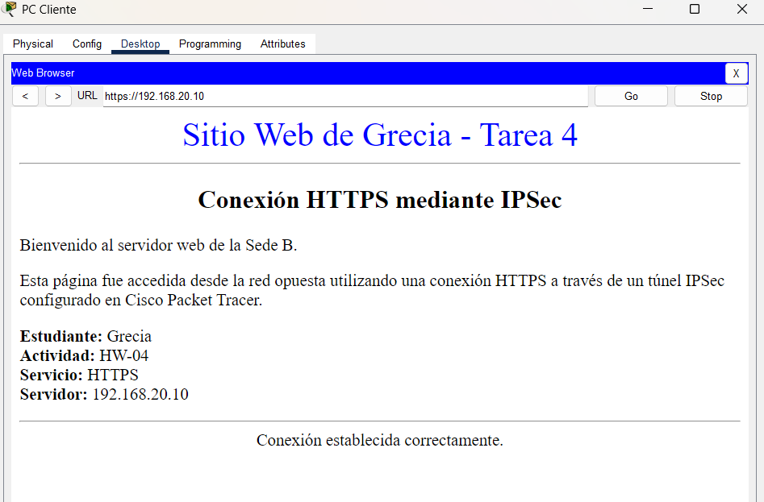
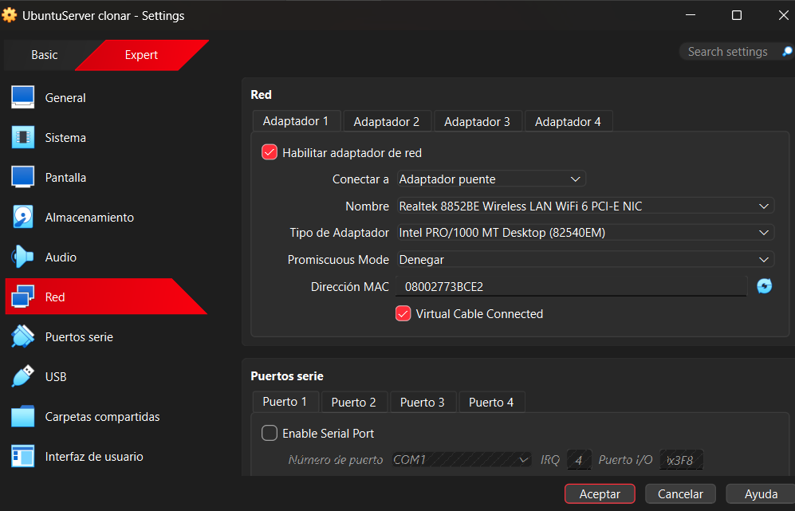
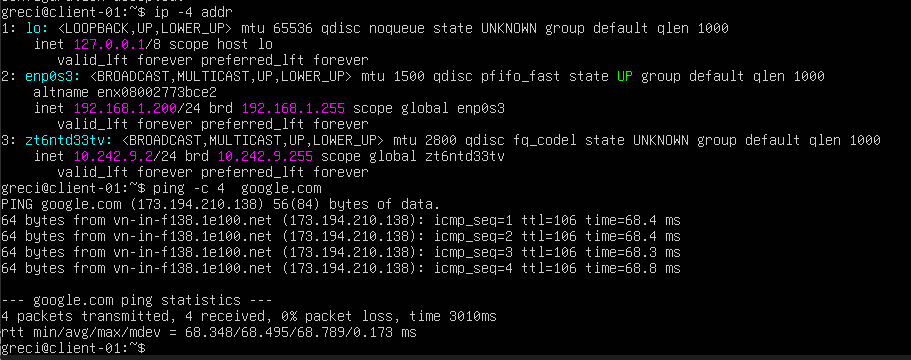
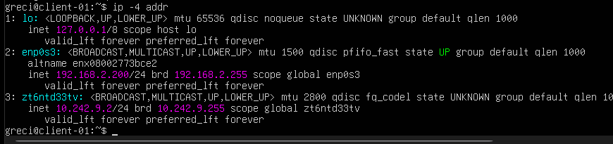
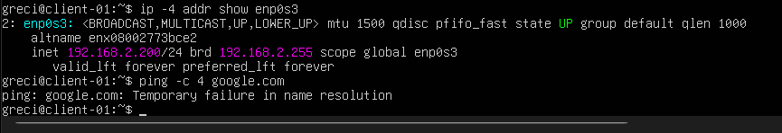

# HW-03 - Virtual Machine Network Configuration


## 1. Configure the Virtual Machine Hostname


The configured hostname is:

```text
GreciaMaq1
```



---

## 2. Verify the Hypervisor Network

The network configuration of the host computer 




---

## 3. Bridge Mode with DHCP

The virtual machine obtained an IP address from the `192.168.1.0/24` network.



Ping requests to Google




---

## 4. Bridge Mode with Manual IP Inside the Subnet


The assigned address was:

```text
192.168.1.200/24
```



Ping requests to Google




---

## 5. Bridge Mode with Manual IP Outside the Subnet

The assigned address was:

```text
192.168.2.200/24
```




Ping requests to Google

There is no Internet access because the VM was assigned the IP 192.168.2.200/24, which is outside the local subnet 192.168.1.0/24. Therefore, the VM cannot correctly reach the gateway 192.168.1.1, causing the ping to google.com to fail.


