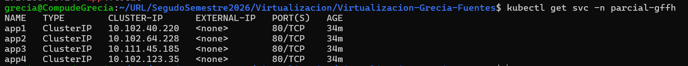
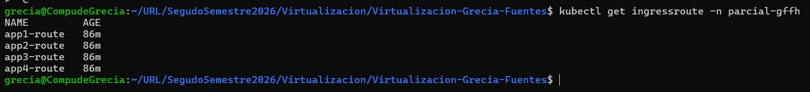
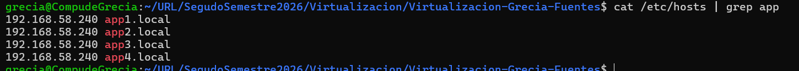
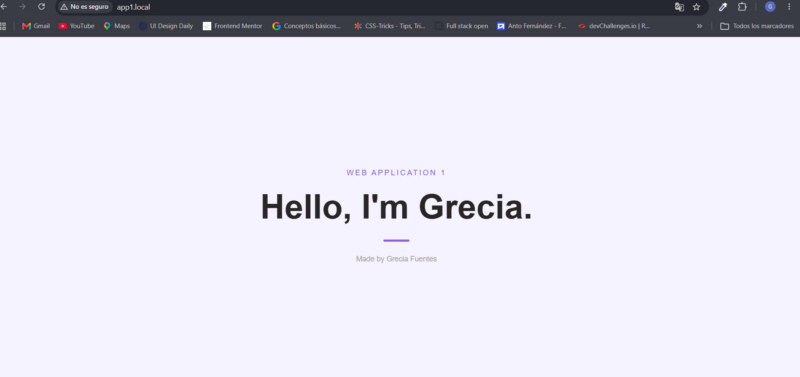
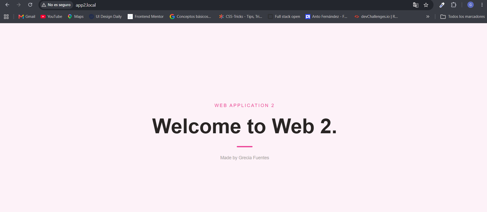
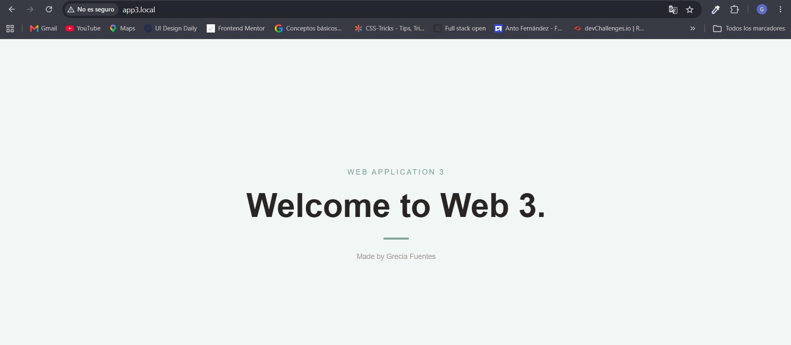
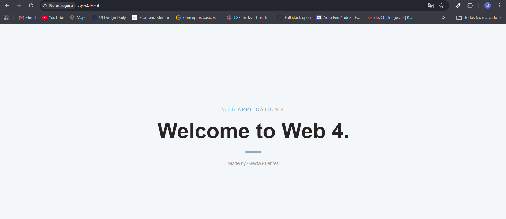
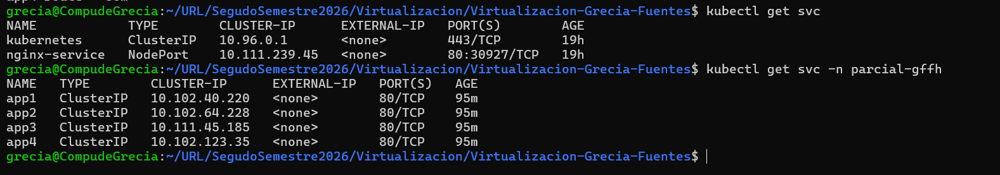

## Assessment 02 Grecia Fuentes - 1537723

---

## 1. MetalLB Configuration

---

## 2. Traefik LoadBalancer

---

## 3. Applications, Pods and Services

Four web applications were deployed in the `parcial-gffh` namespace.

The deployments, pods and services are:

- `app1`
- `app2`
- `app3`
- `app4`

---

## 4. Kubernetes Services

---

## 5. Traefik IngressRoutes

## 6. Local DNS Configuration

---

## 7. Web Application 1

Application URL:

`http://app1.local`

---

## 8. Web Application 2

Application URL:

`http://app2.local`

---

## 9. Web Application 3

Application URL:

`http://app3.local`

---

## 10. Web Application 4

Application URL:

`http://app4.local`

---

## 11. Default Namespace Services (get svc)

