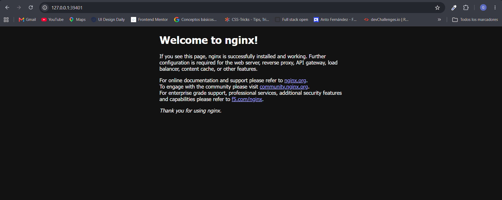
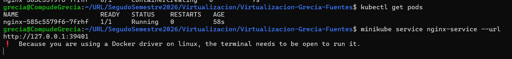
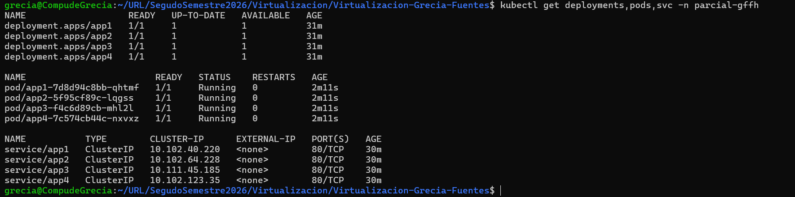

# Virtualizacion-Grecia-Fuentes

## HW-05 - Configuración de servicio Nginx en Kubernetes

### 1. Nginx funcionando en el navegador

### 2. URL del servicio Nginx

### 3. Servicio configurado en Kubernetes

